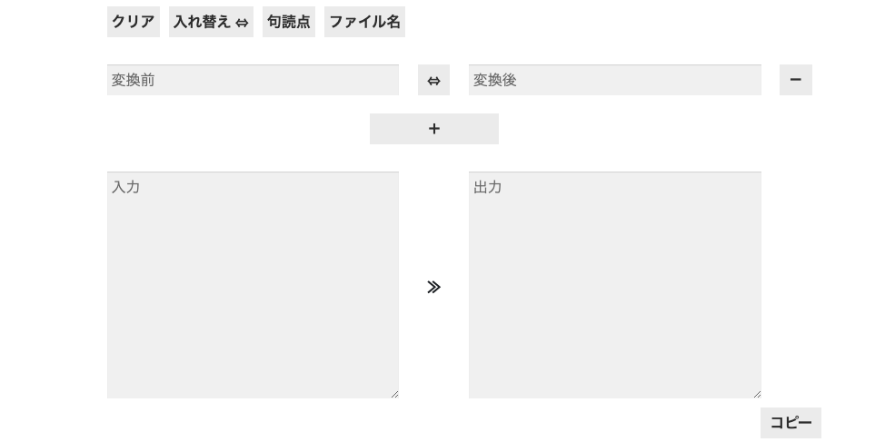

# Replacer

コードを書いていたり、文章を書いていたりすると自動で同時に複数の条件を適用して文字列を変換したくなることがありませんか…？

エディタを使って変換したりしていたのですが、条件を一つしか設定できなかったり、いちいち変換のためにボタンを押すかショートカットを押さないといけなくて、少し不便だったので、ブラウザを使って自分で簡単に実装できるか試してみました。

一応 Replacer と名付けてみたので(?)、もしよかったら使ってみてください。

デモや実装の内容については[こちらの記事](https://blog.n-hassy.info/2022/03/replacer-by-javascript/)で確認することができます。
